LAG4U6 // 2017-2018
====================================

## Cours #01 — Introduction — 15 janvier
* [Télécharger Processing 3](https://www.processing.org/download/)
* [Welcome to Processing](https://vimeo.com/140600280), vidéo en anglais par [Dan Shiffman](http://shiffman.net/) pour [la fondation Processing](https://processingfoundation.org/).

## Cours #02 — Dessiner — 29 janvier
* repère de dessin, dimension de la fenêtre avec [size](https://processing.org/reference/size_.html)
* mode basique
* dessin de formes géométriques : [point](https://processing.org/reference/point_.html), [line](https://processing.org/reference/line_.html), [ellipse](https://processing.org/reference/ellipse_.html), [rect](https://processing.org/reference/rect_.html).
* gestion des couleurs ([color](https://processing.org/reference/color_.html)) et des options de dessin([stroke](https://processing.org/reference/stroke_.html), [noStroke](https://processing.org/reference/noStroke_.html), [fill](https://processing.org/reference/fill_.html), [noFill](https://processing.org/reference/noFill_.html), [strokeWeight](https://processing.org/reference/strokeWeight_.html))
* mode continu :
  * gestionnaires [setup()](https://processing.org/reference/setup_.html) et [draw()](https://processing.org/reference/draw_.html)
* exporter / faire une capture d'écran avec la fonction [saveFrame](https://processing.org/reference/saveFrame_.html)

### Références
* Manuel Floss [FR] - [l'espace de dessing dans Processing](http://fr.flossmanuals.net/processing/lespace-de-dessin/) + [les couleurs](http://fr.flossmanuals.net/processing/les-couleurs/) + [les formes](http://fr.flossmanuals.net/processing/les-formes/)

## Cours #03 — Animer — 5 février
* mode continu : gestionnaires [setup](https://processing.org/reference/setup_.html) et [draw](https://processing.org/reference/draw_.html)
* animer avec le générateur de nombre aléatoire [random](https://processing.org/reference/random_.html)
* variables prédéfinies pour capter la position de la souris : [mouseX](https://processing.org/reference/mouseX.html) et [mouseY](https://processing.org/reference/mouseY.html).
* gestionnaire d'évènements [keyPressed](https://processing.org/reference/keyPressed_.html) pour capter lorsque l'utilisateur appuit sur une touche du clavier.


### Références
* Dan Shiffman [EN] - [Using random()](https://www.youtube.com/watch?v=50Rzvxvi8D0)
* Manuel Floss [FR] - [Dessiner / les évènements souris](https://fr.flossmanuals.net/processing/les-evenements-souris/)

## Cours #04 — Mémoriser — 12 février
* Exporter au format PDF, utilisation conjointe des fonctions [beginRecord](https://processing.org/reference/beginRecord_.html) et [endRecord](https://processing.org/reference/endRecord_.html) avec importation de la librairie PDF de Processing.
* Notions de variables : 
  * Type de données [PFont](https://processing.org/reference/PFont.html), utilisation de l'outil « Générer la police  »
  * Type de données [PImage](https://processing.org/reference/PImage.html), chargement et affichage d'une image.


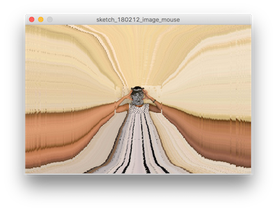


### Références
* Manuel Floss [FR] - [Les variables](http://fr.flossmanuals.net/processing/les-variables/)
* Manuel Floss [FR] - [Les images](http://fr.flossmanuals.net/processing/les-images/)
* Manuel Floss [FR] - [La typographie](http://fr.flossmanuals.net/processing/la-typographie/)
* Dan Shiffman [EN] - [Variables](https://www.youtube.com/watch?v=B-ycSR3ntik)
* Dan Shiffman [EN] - [Intro to images](https://www.youtube.com/watch?v=-f0WEitGmiw)

### Exercice à rendre pour le 26 février
Réaliser un collage d'images (au moins trois) qui représente un visage. Un des éléments (yeux, bouche, ...) doit être animé et mouvant en fonction de la position de la souris.

<p>


*Collages de [John Stezaker](https://en.wikipedia.org/wiki/John_Stezaker) et [Louise Bédart](http://lbdanse.org/collages/)*
</p>

## Cours #05 — Modéliser — 26 février
* Utiliser les informations de couleur contenues dans une image via la fonction [PImage.get(x,y)](https://processing.org/reference/get_.html) pour générer une composition « pointilliste ».
* Branchement / condition avec if 
* Modélisation d'une bille rebondissante sur les bordures de la fenêtre : position, vitesse et conditions aux limites. 


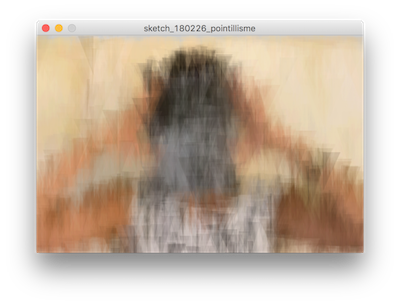


### Références
* Manuel Floss [FR] - [Les images](https://fr.flossmanuals.net/processing/les-images/)
* Manuel Floss [FR] - [Les conditions](https://fr.flossmanuals.net/processing/les-conditions/)
* Site Processing [EN] - [Pointillism](https://processing.org/examples/pointillism.html)

## Cours #06 — Répéter — 5 mars
* Révision des branchements avec la création d'un bouton avec rollover et click.
* [Boucle for](https://fr.flossmanuals.net/processing/les-repetitions/) pour répéter une série d'instructions.
* Utilisation d'une double boucle imbriquée pour paver l'espace.

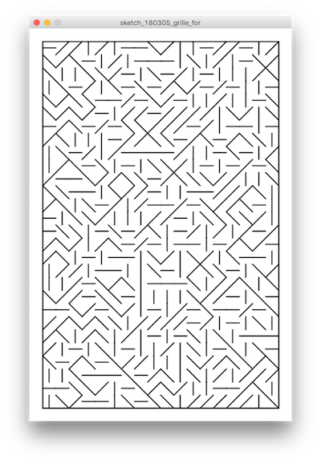
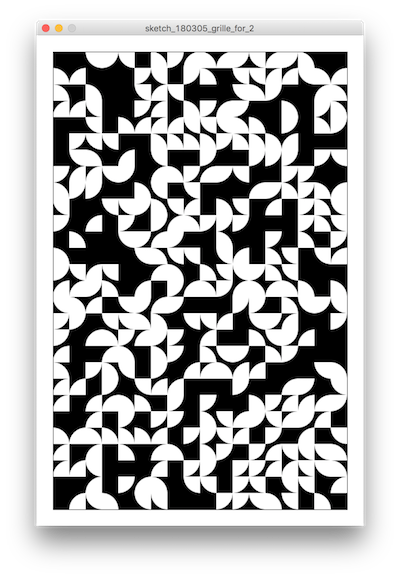

### Références
* Manuel Floss [FR] - [Les répétitions](https://fr.flossmanuals.net/processing/les-repetitions/)
* Casey Reas [EN] — [10 PRINT CHR$(205.5+RND(1))](http://reas.com/10_print/)
* [Vera Molnar](http://www.veramolnar.com/)
* [Frider Nake](http://dada.compart-bremen.de/item/agent/68) 
* [Recode project](http://recodeproject.com/)


### Exercice à rendre pour le 12 mars
En reprenant [un des sketchs de ce cours](https://raw.githubusercontent.com/v3ga/Cours_Bordeaux_Montaigne/master/L2_2017_2018/cours06/sketch_180305_grille_for/sketch_180305_grille_for.pde) sur le pavage du plan, créer une série de motifs (au moins quatre) qui s'insèrent dans une cellule de la grille. Il s'agit à l'intérieur des boucles for de choisir un nombre entier aléatoire (entre 0 et 3 compris) et en fonction de dessiner une forme géométrique dont les coordonnées tiennent compte de la position (x,y) de la cellule de la grille et de sa dimension (pas,pas). La valeur de la variable *pas* peut-être changée bien entendu, ça fonctionne mieux si c'est un diviseur de la largeur de la hauteur (10, 25, 50 par exemple)

````
// Choix du nombre au hasard
// En fonction de ce nombre, nous allons dessiner un motif
// Les valeurs de rnd peuvent être : 0, 1, 2 ou 3
rnd = int(random(4));

// Dessin des motifs
if (rnd == 0)
{
  line(x, y, x+pas, y+pas);
} 
else if (rnd == 1)
{
  line(x+pas, y, x, y+pas);
} 
else if (rnd == 2)
{
  line(x+pas/2, y, x+pas/2, y+pas);
} 
else if (rnd == 3)
{
  line(x, y+pas/2, x+pas, y+pas/2);
}
````
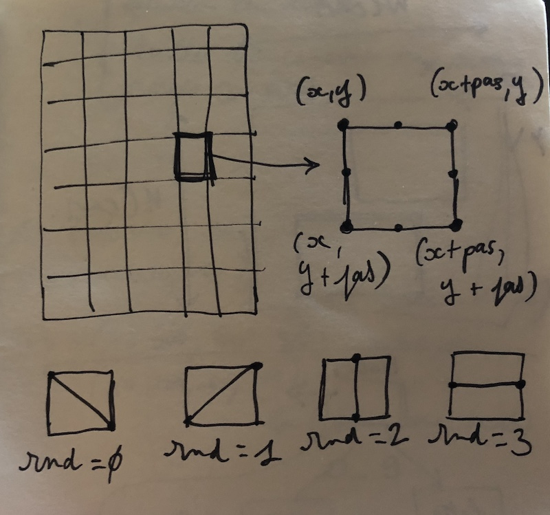

## Cours #07 — Transformer — 12 mars
* Travail sur l'exercice de dessin de grilles à remettre. J'ai vu de belles choses, c'est bien ! 
* Type de données [PShape](https://processing.org/reference/createShape_.html) pour créer ses propres formes de dessin autres que les formes de base ( voir [le sketch pour dessiner une croix](https://raw.githubusercontent.com/v3ga/Cours_Bordeaux_Montaigne/master/L2_2017_2018/cours07/sketch_180311_PShape_croix/sketch_180311_PShape_croix.pde))
* Transformations :
  * fonction [translate](https://processing.org/reference/translate_.html)
  * fonction [rotate](https://processing.org/reference/translate_.html)

*J'ai vu ces notions avec le groupe de 8h30, aussi nous les reverrons lundi prochain pour que tout le monde soit à niveau.*

## Cours #08 — Transformer et animer — 19 mars
* [PGraphics](https://processing.org/reference/PGraphics.html) : calque externe à la fenêtre pour dessiner, utilisation d'un tableau de PGraphics pour créer l'illusion d'une animation en boucle.
* [PShape](https://processing.org/reference/createShape_.html) : type de données qui permet de définir une forme géométrique à partir de points (appelé « vertex »).
* Transformations du repère de dessin :
  * fonction [translate](https://processing.org/reference/translate_.html)
  * fonction [rotate](https://processing.org/reference/translate_.html)
* Répartition sur une spirale :  déplacement et rotation simultanées.
  
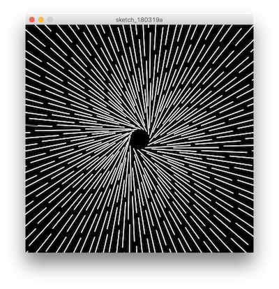
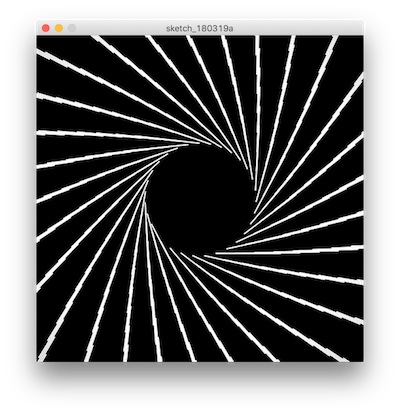

### Exercice à rendre pour le 27 mars
À partir de ce sketch de dessin ([lien vers le template](cours08/sketch_180321_template_exercice/sketch_180321_template_exercice.pde)), vous définissez *trois formes géométriques de couleur différente* par l'intermédiaire de **PShape** qui seront stockées dans un tableau. L'utilisateur aura la possibilité de sélectionner l'une de ces trois formes pour dessiner sur l'écran en appuyant sur l'une des trois touches 'a', 'b', 'c'. Une composition pourra être sauvée au format *png* en appuyant sur la touche 's' du clavier.
Voici quelques exemples tirés du livre [« Design génératif »](https://pyramyd-editions.com/products/design-generatif). Vous pouvez retrouver les sketchs qui produisent ces images [en suivant ce lien](http://www.generative-gestaltung.de/1/P_2_3_1_02) : 

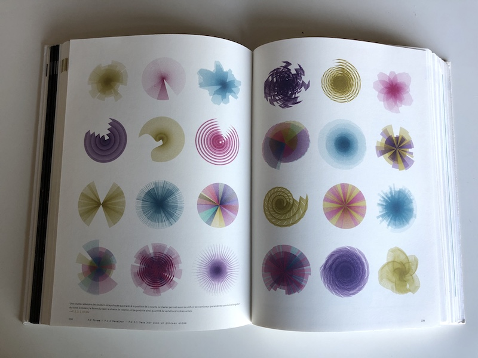

Est attendu : 
* le sketch de dessin.
* au moins une image de la composition.

## Cours #09 — Bruit de fond — 30 mars
* [Tableaux / listes](https://processing.org/reference/arrayaccess.html)
* Perlin noise 1D,2D,3D avec la fonction [noise](https://processing.org/reference/noise_.html)
* Application à un ensemble de particules dont la direction de vitesse est paramétrée par la valeur noise en (x,y,temps). Stockage des informations dans une ensemble de tableaux. 

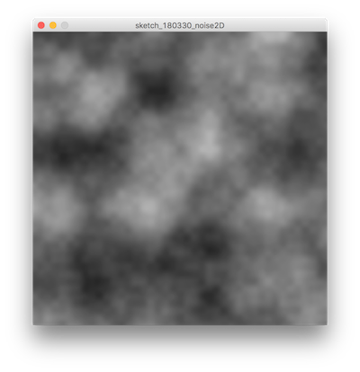
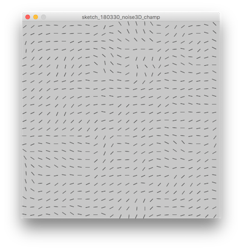
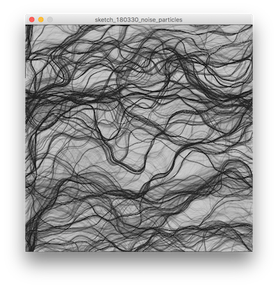


### Références
* Manuel Floss [FR] - [Les listes](https://fr.flossmanuals.net/processing/les-listes/)
* [Perlin Noise](https://wangyasai.github.io/Perlin-Noise/)
* Dan Shiffman [EN] - [Perlin Noise](https://www.youtube.com/watch?v=8ZEMLCnn8v0)

## Cours #10 — Tourner en rond — 9 avril
* Librairie à télécharger : [GifAnimation.zip](cours10/GifAnimation.zip)
   * Une librairie est une extension de code qui permet d'étendre les fonctionnalités de base de Processing. Il en existe des dizaines qui couvrent un ensemble de sujets divers : 3D, animation, traitement de données, typographie, etc ... Le lien suivant compile une liste « officielle » des librairies : https://processing.org/reference/libraries/
   * Une fois décompressée, le dossier est à copier dans le dossier **Mes Documents/Processing/libraries** (votre *sketchbook*). C'est une installation manuelle, sinon il est possible d'installer les librairies depuis le menu **Sketch > Importer une librairie ... > Ajouter une librairie ...**
   * Il est nécessaire de relancer Processing pour que les modifications sont prises en compte.
   


