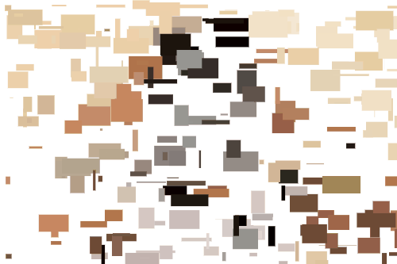
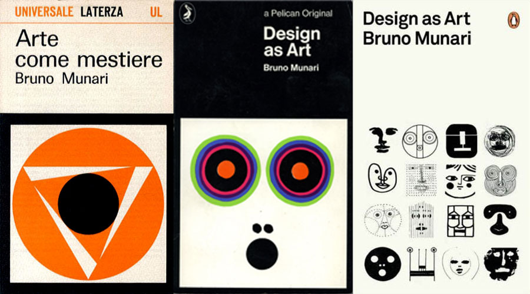
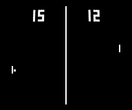

LAG4U6 // 2020-2021
====================================

Ce cours aura pour but de vous donner les clés de compréhension de la programmation graphique dans un environnement web [p5.js](https://p5js.org/) en relation avec la pratique de design interactif. 

*Le design interactif s'est élaboré dans la rencontre de deux phénomènes majeurs de l'Histoire récente. Tout d'abord, il est le fruit de la rupture que les courants de pensées artistiques et philosophiques ont effectué avec la pensée classique, qui a prédominé jusqu'au début du XXe siècle. A une vision statique et idéale de notre univers s'est substituée sous l'influence de la science une réalité fondée sur la relativité du temps et l'importance fondamentale accordée à la notion d'échanges. Parrallèlement, le design s'est enrichi des possibilités ouvertes par le développement des nouvelles technologies.* 
**Patrice Meunier & Kuei Yu Ho** — [Design interactif](https://www.editions-eyrolles.com/Livre/9782212129724/design-interactif)

## Sketches en ligne
✍️ https://editor.p5js.org/v3ga/collections/nOmAbMBnE

## Cours en ligne 
📼 [Cours #01 — Introduction — 18 janvier](https://www.youtube.com/watch?v=XXbs_8kn5m4) 
📼 [Cours #02 — Dessiner — 25 janvier](https://www.youtube.com/watch?v=XFBZiy8r9jQ) 
📼 [Cours #03 — Animer — 1er février](https://youtu.be/_WyUHqWTTp4) 
📼 [Cours #04 — Mémoriser — 24 février](https://youtu.be/WAQtpuWMVvY) 
📼 [Cours #05 — Modéliser — 1er mars](https://youtu.be/vjtkl8sPST0) 
📼 [Cours #06 — Répéter — 8 mars](https://youtu.be/bujeEaaPzS8) 
📼 [Cours #07 — Transformer — 15 mars](https://youtu.be/rVWE1U_dnXw) 
📼 [Cours #08 — Encapsuler — 22 mars](https://youtu.be/xROnX6gidfQ) 
📼 [Cours #09 — Démultiplier — 29 mars](https://youtu.be/4YmHeIFt8cQ) 

### Barême pour les exercices / projets
Pour les exercices que je vous donne, le barême est le suivant (sur 10)
* **rendu en temps et en heure** :point_right: 1 point.
* **respect de la consigne** :point_right: 3 points. 
Le sketch doit être au bon format : 
   * envoi de l'adresse du sketch en ligne sur [editor.p5.js](https://editor.p5js.org/)
   * les noms de sketches seront sous la forme **sketch_date_rendu_nom_prenom**. Exemple : exercice à rendre pour le 18 février :point_right: sketch_190218_dupond_marie
   * envoi par e-mail, **pas de wetransfer (merci)**.
* **créativité** :point_right: 6 points. 
J'entends par créativité une recherche graphique personelle et/ou interactive qui peut se faire à partir de sketches vus en classe ou de références que vous trouvez en ligne.

## Cours #01 [en ligne] — Introduction — 18 janvier 
Vidéo en ligne :point_right: https://www.youtube.com/watch?v=XXbs_8kn5m4

* Présentation du travail de [2Roqs](http:www.2roqs.com) et du travail de designer d'interactions / créateurs numériques.
* Présentation de l'environnement [Processing](http://www.processing.org) et de son « écosystème » (notamment [p5.js](https://p5js.org/))
* Présentation de l'environnement de développement et premières commandes de dessin dans l'éditeur en ligne [editor.p5js.org/](https://editor.p5js.org/) 

### Références
* [A Modern Prometheus — The history of Processing by C.Reas & B.Fry](https://medium.com/processing-foundation/a-modern-prometheus-59aed94abe85)
* [Welcome to Processing](https://vimeo.com/140600280), vidéo en anglais par [Dan Shiffman](http://shiffman.net/) pour [la fondation Processing](https://processingfoundation.org/).
* [Design by Numbers](https://dbn.media.mit.edu/) de [John Maeda](https://maedastudio.com/)
* [Ben Fry](https://www.benfry.com/) and [Casey Reas](http://reas.com/)

 ### Ressources
* **[Designing Programs par Mark Webster](https://designingprograms.bitbucket.io/)** 
« Designing Programs is a practical and pedagogical approach to programming, tailored for visual arts students. »
* **[Programming design systems par Rune Madsen](https://www.programmingdesignsystems.com/)**  
« A free digital book that teaches a practical introduction to the new foundations of graphic design. By Rune Madsen. »

## Cours #02 — Dessiner — 25 janvier
Vidéo en ligne :point_right: https://www.youtube.com/watch?v=XFBZiy8r9jQ
* repère de dessin, espace de dessin [p5js / createCanvas](https://p5js.org/reference/#/p5/createCanvas)
* dessin de formes géométriques : [point](https://processing.org/reference/point_.html), [line](https://processing.org/reference/line_.html), [ellipse](https://processing.org/reference/ellipse_.html), [rect](https://processing.org/reference/rect_.html).
* dessin de formes géométriques « composées » : [beginShape](https://processing.org/reference/beginShape_.html) / [vertex](https://processing.org/reference/vertex_.html) / [endShape](https://processing.org/reference/endShape_.html)
* gestion des couleurs ([color](https://processing.org/reference/color_.html)) et des options de dessin([stroke](https://processing.org/reference/stroke_.html), [noStroke](https://processing.org/reference/noStroke_.html), [fill](https://processing.org/reference/fill_.html), [noFill](https://processing.org/reference/noFill_.html), [strokeWeight](https://processing.org/reference/strokeWeight_.html))
* exporter / faire une capture d'écran avec la fonction [p5js / save](https://p5js.org/reference/#/p5/save)

## Cours #03 — Animer — 1er février
Vidéo en ligne :point_right: https://youtu.be/_WyUHqWTTp4

* Animer : 
  * avec une fonction génératrice de nombre aléatoires : [random](https://processing.org/reference/randomGaussian_.html)  
  * avec la variable de temps [frameCount](https://processing.org/reference/frameCount_.html) et la fonction [millis()](https://processing.org/reference/millis_.html)
  * avec les variables [mouseX](https://processing.org/reference/mouseX.html) et [mouseY](https://processing.org/reference/mouseY.html) pour capter la position de la souris dans le canvas.  

### Références
* Dan Shiffman [EN] - [Using random()](https://www.youtube.com/watch?v=50Rzvxvi8D0)
* Manuel Floss [FR] - [Dessiner / les évènements souris](https://fr.flossmanuals.net/processing/les-evenements-souris/)

## Cours #04 — Mémoriser — 24 février
Vidéo en ligne :point_right: https://youtu.be/WAQtpuWMVvY

Introductions à la notion de variables :
* Chargement et affichage d'une [image](https://p5js.org/reference/#group-Image).
* Utiliser la fonction [imageMode()](https://p5js.org/reference/#/p5/imageMode) pour changer l'origine du dessin de l'image
* Utiliser les informations de couleur contenues dans une image via la fonction [get()](https://p5js.org/reference/#/p5/get) pour générer une composition « pointilliste »

#### Exercice à rendre pour le dimanche 7 mars
L'exercice sera de dessiner un visage avec des éléments géométriques (lignes, courbes, formes) à la façon de Bruno Munari dans le livre [« Design as Art »](http://www.strabic.fr/Bruno-Munari), dans le paragraphe [« Variation on the Theme of the Human Face »](https://youtu.be/EysmeN6CPII?t=230).  Vous n'utiliserez que du noir et du blanc sur un espace de dessin de 500 pixels de large et de haut. Une attention particulière sera portée à l'expressivité du visage que vous dessinerez.

:point_right: voir le lien https://hafiprocessjournal.wordpress.com/2014/10/16/bruno-munari/

## Cours #05 — Modéliser — 1er mars
Vidéo en ligne :point_right: https://youtu.be/vjtkl8sPST0

* Branchement / condition avec [if](https://p5js.org/reference/#/p5/if-else) : exécuter des blocs de code en fonction de l'évaluation de conditions.
* Modélisation d'une bille rebondissante sur les bordures de la fenêtre : 
  * utilisation de variables pour représenter les position / vitesse sur le canvas.
  * utilisation des conditions pour que la bille reste à l'intérieur du canvas.
* Programmation du jeu [Pong](https://fr.wikipedia.org/wiki/Pong) avec le modèle de bille / balle et de raquettes.

## Cours #06 — Répéter — 8 mars
Visio. en ligne 👉 https://youtu.be/bujeEaaPzS8

* Révision de [la structure de controle if](https://fr.flossmanuals.net/processing/les-conditions/)
* [Boucle for](https://fr.flossmanuals.net/processing/les-repetitions/) pour répéter une série d'instructions.
* Utilisation d'une double boucle imbriquée pour paver l'espace avec un motif.

### Références
* Manuel Floss [FR] - [Les répétitions](https://fr.flossmanuals.net/processing/les-repetitions/)
* Casey Reas [EN] — [10 PRINT CHR$(205.5+RND(1))](https://p5js.org/reference/#/p5/translate)

## Cours #07 — Transformer — 15 mars
Visio. en ligne 👉 https://youtu.be/rVWE1U_dnXw

Pour ce TD, nous allons apprendre à changer le repère de dessin dans le canvas, ce qui va nous permettre notamment d'appliquer des transformations sur les motifs géométriques dessinés. L'idée sera de fabriquer un « spirographe » interactif et évoluant avec le temps. Nous en profiterons pour revoir la notion de boucles for. 

#### Exercice à rendre pour le mercredi 31 mars
Vous définirez 4 formes graphiques à utiliser dans le modèle de grille que nous avons développé au cours #06 et revu au cours #08. Pour cela, vous implémenterez les quatre fonctions **motif0()**, **motif1()**, **motif2()** et **motif3()**. Ces quatre fonctions ne prennent qu'un seul paramètre, qui correspont à la taille de la cellule. Pour l'exemple, j'ai implémenté la fonction motif0() avec le d'une diagonale.

Vous êtez libres sur le choix des motifs (lignes, formes pleines, couleurs) et sur le choix de résolution de cette grille, cette dernière étant définie par la variable globale **nb**. Vous pouvez mettre en commentaire la ligne **drawCell(i,j,r)** qui correspond au dessin des informations de la cellule.

Sur la méthode de travail, n'hésitez pas à dessiner / faire un croquis des motifs que vous voulez réaliser par code sur une feuille de papier et à les tester dans des sketchs séparés avant de les reporter dans le code de la grille.  

Voici le template en ligne sur lequel vous pouvez vous baser : https://editor.p5js.org/v3ga/sketches/CpD4i69Na

## Cours #08 — Encapsuler — 22 mars
Visio. en ligne 👉 https://youtu.be/xROnX6gidfQ

* Révision de la structure de boucle
* Transformations, fonctions push() / pop() pour sauvegarder / restaurer une transformation.
* Grouper des commandes dans une fonction.

## Cours #09 — Démultiplier — 29 mars
Visio. en ligne 👉 https://youtu.be/4YmHeIFt8cQ

Pour ce cours, nous allons aborder la notion de [tableaux](https://www.lyceelecorbusier.eu/p5js/?p=2614) qui va permettre de référencer un ensembler d'objets depuis une seule variable. Nous appliquerons ce concept à la création d'un système de particules, en nous basant sur la modélisation que nous avons vue au cours #05. Nous passerons de la gestion d'une particule à [n] particules.
L'écriture et la lecture d'un tableau va se faire à travers une boucle for, notion vue au cours #06.

## Cours #10 — Projeter — 11 avril
Visio. en ligne 👉 *à venir*

Pour ce TD, nous allons transformer notre espace de dessin en lui donnant une profondeur. Nous allons travailler en trois dimensions par l'intermédiaire du mode [WEBGL](https://github.com/processing/p5.js/wiki/Getting-started-with-WebGL-in-p5) de p5.js. Nous en profiterons pour revoir les transformations (translate / rotate) et nous transférerons les  particules du cours #09 de la 2D à la 3D. 

