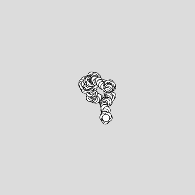

LAG4U6 // 2020-2021
====================================

Ce cours aura pour but de vous donner les clés de compréhension de la programmation graphique dans un environnement web [p5.js](https://p5js.org/) en relation avec la pratique de design interactif. 

*Le design interactif s'est élaboré dans la rencontre de deux phénomènes majeurs de l'Histoire récente. Tout d'abord, il est le fruit de la rupture que les courants de pensées artistiques et philosophiques ont effectué avec la pensée classique, qui a prédominé jusqu'au début du XXe siècle. A une vision statique et idéale de notre univers s'est substituée sous l'influence de la science une réalité fondée sur la relativité du temps et l'importance fondamentale accordée à la notion d'échanges. Parrallèlement, le design s'est enrichi des possibilités ouvertes par le développement des nouvelles technologies.* 
**Patrice Meunier & Kuei Yu Ho** — [Design interactif](https://www.editions-eyrolles.com/Livre/9782212129724/design-interactif)

## Sketches en ligne
✍️ https://editor.p5js.org/v3ga/collections/nOmAbMBnE

## Cours en ligne 
📼 [Cours #01 — Introduction — 18 janvier](https://www.youtube.com/watch?v=XXbs_8kn5m4) 
📼 [Cours #02 — Dessiner — 25 janvier](https://www.youtube.com/watch?v=XFBZiy8r9jQ)
📼 [Cours #03 — Animer — 1er février](https://youtu.be/_WyUHqWTTp4)

## Cours #01 [en ligne] — Introduction — 18 janvier 
Vidéo en ligne :point_right: https://www.youtube.com/watch?v=XXbs_8kn5m4

* Présentation du travail de [2Roqs](http:www.2roqs.com) et du travail de designer d'interactions / créateurs numériques.
* Présentation de l'environnement [Processing](http://www.processing.org) et de son « écosystème » (notamment [p5.js](https://p5js.org/))
* Présentation de l'environnement de développement et premières commandes de dessin dans l'éditeur en ligne [editor.p5js.org/](https://editor.p5js.org/) 

### Références
* [A Modern Prometheus — The history of Processing by C.Reas & B.Fry](https://medium.com/processing-foundation/a-modern-prometheus-59aed94abe85)
* [Welcome to Processing](https://vimeo.com/140600280), vidéo en anglais par [Dan Shiffman](http://shiffman.net/) pour [la fondation Processing](https://processingfoundation.org/).
* [Design by Numbers](https://dbn.media.mit.edu/) de [John Maeda](https://maedastudio.com/)
* [Ben Fry](https://www.benfry.com/) and [Casey Reas](http://reas.com/)

 ### Ressources
* **[Designing Programs par Mark Webster](https://designingprograms.bitbucket.io/)** 
« Designing Programs is a practical and pedagogical approach to programming, tailored for visual arts students. »
* **[Programming design systems par Rune Madsen](https://www.programmingdesignsystems.com/)**  
« A free digital book that teaches a practical introduction to the new foundations of graphic design. By Rune Madsen. »

## Cours #02 — Dessiner — 25 janvier
Vidéo en ligne :point_right: https://www.youtube.com/watch?v=XFBZiy8r9jQ
* repère de dessin, espace de dessin [p5js / createCanvas](https://p5js.org/reference/#/p5/createCanvas)
* dessin de formes géométriques : [point](https://processing.org/reference/point_.html), [line](https://processing.org/reference/line_.html), [ellipse](https://processing.org/reference/ellipse_.html), [rect](https://processing.org/reference/rect_.html).
* dessin de formes géométriques « composées » : [beginShape](https://processing.org/reference/beginShape_.html) / [vertex](https://processing.org/reference/vertex_.html) / [endShape](https://processing.org/reference/endShape_.html)
* gestion des couleurs ([color](https://processing.org/reference/color_.html)) et des options de dessin([stroke](https://processing.org/reference/stroke_.html), [noStroke](https://processing.org/reference/noStroke_.html), [fill](https://processing.org/reference/fill_.html), [noFill](https://processing.org/reference/noFill_.html), [strokeWeight](https://processing.org/reference/strokeWeight_.html))
* exporter / faire une capture d'écran avec la fonction [p5js / save](https://p5js.org/reference/#/p5/save)

## Cours #03 — Animer — 1er février
Vidéo en ligne :point_right: https://youtu.be/_WyUHqWTTp4

* Animer : 
  * avec une fonction génératrice de nombre aléatoires : [random](https://processing.org/reference/randomGaussian_.html)  
  * avec la variable de temps [frameCount](https://processing.org/reference/frameCount_.html) et la fonction [millis()](https://processing.org/reference/millis_.html)
  * avec les variables [mouseX](https://processing.org/reference/mouseX.html) et [mouseY](https://processing.org/reference/mouseY.html) pour capter la position de la souris dans le canvas.  

### Références
* Dan Shiffman [EN] - [Using random()](https://www.youtube.com/watch?v=50Rzvxvi8D0)
* Manuel Floss [FR] - [Dessiner / les évènements souris](https://fr.flossmanuals.net/processing/les-evenements-souris/)

## Cours #04 — Mémoriser — 8 février
Introductions à la notion de variables :
* Chargement et affichage d'une [image](https://p5js.org/reference/#group-Image).
* Utiliser la fonction [imageMode()](https://p5js.org/reference/#/p5/imageMode) pour changer l'origine du dessin de l'image
* Utiliser les informations de couleur contenues dans une image via la fonction [get()](https://p5js.org/reference/#/p5/get) pour générer une composition « pointilliste »

