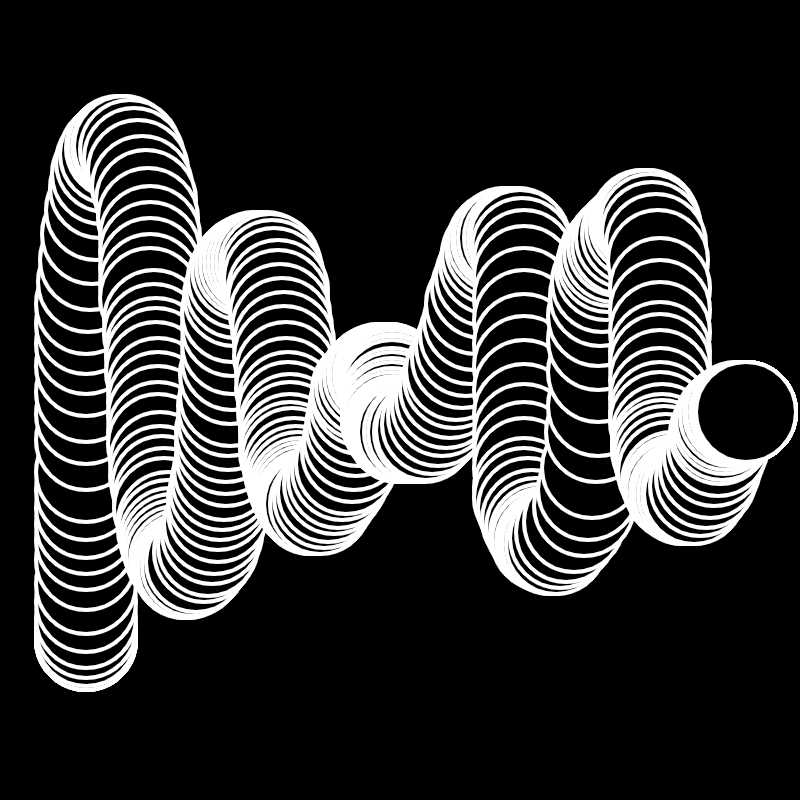

LAG4U6 // 2021-2022
====================================

Ce cours aura pour but de vous donner les clés de compréhension de la programmation graphique dans un environnement web [p5.js](https://p5js.org/) en relation avec la pratique de dessin génératif. 

## Sketches en ligne
✍️ https://editor.p5js.org/v3ga/collections/YLR_BH2Hb

## Cours en ligne LAG4U6 2021
✍️ https://www.youtube.com/watch?v=XXbs_8kn5m4&list=PLSQ5mjdHDgdAAW-GQRh6uke4krsGuhsWZ

## Cours #01 — Introduction — 17 janvier 2022 
* Présentation du travail de [2Roqs](http:www.2roqs.com) et du travail de designer d'interactions / créateurs numériques.
* Présentation de l'environnement [Processing](http://www.processing.org) et de son « écosystème » (notamment [p5.js](https://p5js.org/))
* Présentation de l'environnement de développement et premières commandes de dessin dans l'éditeur en ligne [editor.p5js.org/](https://editor.p5js.org/) 

### Références
* [A Modern Prometheus — The history of Processing by C.Reas & B.Fry](https://medium.com/processing-foundation/a-modern-prometheus-59aed94abe85)
* [Welcome to Processing](https://vimeo.com/140600280), vidéo en anglais par [Dan Shiffman](http://shiffman.net/) pour [la fondation Processing](https://processingfoundation.org/).
* [Design by Numbers](https://dbn.media.mit.edu/) de [John Maeda](https://maedastudio.com/)
* [Ben Fry](https://www.benfry.com/) and [Casey Reas](http://reas.com/)

## Cours #02 — Dessiner — 24 janvier 
* repère de dessin, espace de dessin [p5js / createCanvas](https://p5js.org/reference/#/p5/createCanvas)
* dessin de formes géométriques : [point](https://processing.org/reference/point_.html), [line](https://p5js.org/reference/#/p5/line), [ellipse](https://p5js.org/reference/#/p5/ellipse), [rect](https://p5js.org/reference/#/p5/rect).
* dessin de formes géométriques « composées » : [beginShape](https://p5js.org/reference/#/p5/beginShape) / [vertex](https://p5js.org/reference/#/p5/vertex) / [endShape](https://p5js.org/reference/#/p5/endShape)
* gestion des couleurs ([color](https://p5js.org/reference/#/p5/color)) et des options de dessin([stroke](https://p5js.org/reference/#/p5/stroke), [noStroke](https://p5js.org/reference/#/p5/noStroke), [fill](https://p5js.org/reference/#/p5/fill), [noFill](https://p5js.org/reference/#/p5/noFill), [strokeWeight](https://p5js.org/reference/#/p5/strokeWeight))
* exporter / faire une capture d'écran avec la fonction [p5js / save](https://p5js.org/reference/#/p5/save)

### Références
* [Rune Madsen / Computational color](http://printingcode.runemadsen.com/lecture-color/)

### Exercice
Choisir une des œuvres [« Homages to the square »](https://albersfoundation.org/art/josef-albers/paintings/homages-to-the-square/) de Josef Albers pour le récréer avec du code.

## Cours #03 — 31 janvier
À rattraper.

## Cours #04 — Animer — 7 février
* Animer : 
  * avec une fonction génératrice de nombre aléatoires : [random](https://p5js.org/reference/#/p5/random)  
  * avec la variable de temps [frameCount](https://p5js.org/reference/#/p5/frameCount) et la fonction [millis()](https://p5js.org/reference/#/p5/millis)
  * avec les variables [mouseX](https://p5js.org/reference/#/p5/mouseX) et [mouseY](https://p5js.org/reference/#/p5/mouseY) pour capter la position de la souris dans le canvas.

 href="https://editor.p5js.org/v3ga/sketches/EVwfXPxCb"></a> href="https://editor.p5js.org/v3ga/sketches/oafZbGPwx"></a>

### Références
* Dan Shiffman [EN] - [Using random()](https://www.youtube.com/watch?v=50Rzvxvi8D0)
* Manuel Floss [FR] - [Dessiner / les évènements souris](https://fr.flossmanuals.net/processing/les-evenements-souris/)

### Exercice
Personnaliser le motif de dessin en jouant : sur la forme en elle-même, sur ses couleurs, sur les options de dessin (contour / remplissage)  

## Cours #05 — Mémoriser — 14 février
Introduction à la notion de variable :
* Chargement et affichage d'une [image](https://p5js.org/reference/#group-Image), gestionnaire [preload()](https://p5js.org/reference/#/p5/preload)
* Utiliser la fonction [imageMode()](https://p5js.org/reference/#/p5/imageMode) pour changer l'origine du dessin de l'image
* Utiliser les informations de couleur contenues dans une image via la fonction [get()](https://p5js.org/reference/#/p5/get) pour générer une composition « pointilliste »

 

#### Exercice à rendre pour le dimanche 7 mars
L'exercice sera de dessiner un visage avec des éléments géométriques (lignes, courbes, formes) à la façon de Bruno Munari dans le livre [« Design as Art »](http://www.strabic.fr/Bruno-Munari), dans le paragraphe [« Variation on the Theme of the Human Face »](https://youtu.be/EysmeN6CPII?t=230).  Vous n'utiliserez que du noir et du blanc sur un espace de dessin de 500 pixels de large et de haut. Une attention particulière sera portée à l'expressivité du visage que vous dessinerez.

:point_right: voir le lien https://hafiprocessjournal.wordpress.com/2014/10/16/bruno-munari/

