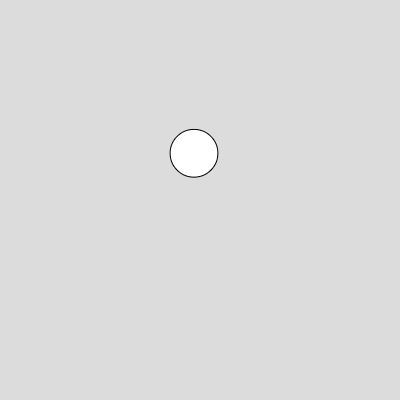

LAG6U6 // 2020-2021
====================================

Nous continuerons d'explorer les potentialités de l'écosystème [p5.js](https://p5js.org/) au travers d'algorithmes graphiques (systèmes de particules, agents autonomes, automates cellulaires, ...) en mettant l'accent sur la production de visuels animés interactifs en temps réel et la création d'outils basés sur les technologies web.
L'objectif sera de proposer une installation numérique collective présentée à [la Fabrique Pola](https://pola.fr/) à la fin du semestre, les modalités et la scénographie seront à imaginer ensemble.

## Sketches en ligne
✍️ https://editor.p5js.org/v3ga/collections/re8BJbw3p

## Cours en ligne 
📼 [Cours #01 — Remise dans le bain — 18 janvier](https://youtu.be/N598oS3DThA)<br>
📼 [Cours #02 — Champ vectoriel (flow field) — 25 janvier](https://youtu.be/xFi238AjLlE)<br>
📼 [Cours #03 — Forces — 1er février](https://youtu.be/g5BRhRPa7P0)<br>
📼 [Cours #04 — Physique des solides — 8 février](https://www.youtube.com/watch?v=4rkqkz2UhIE)<br />
📼 [Cours #05 — Physique des solides : les contraintes — 1er mars](https://youtu.be/5TJXqVjHiIA)<br />
📼 [Cours #06 — Agents autonomes : les boids — 8 mars](https://youtu.be/R7M27mhFOiE)<br />
📼 Cours #07 — Typographie générative — 15 mars / oubli d'enregistrement 😰<br />
📼 [Cours #08 — Typographie générative (bis) — 25 mars](https://www.youtube.com/watch?v=hJXPOCh9778)<br />
📼 [Cours #09 — 3d et travail personnel — 29 mars](https://www.youtube.com/watch?v=1Nj9d58lkTs)<br />


## Cours #01 [en ligne] — Remise dans le bain — 18 janvier 
Visio. en ligne :point_right: https://youtu.be/N598oS3DThA

Ce premier va être une remise dans le bain des «briques» vues l'an passé. Nous avons aborder une brique importante de la programmation : la notion de classe. Nous allons travailler sur un système de particules (en reprenant notamment le modèle de bille dans ce sketch : https://editor.p5js.org/v3ga/sketches/JoO-Vi58) et nous reverrons notamment le stockage d'objets dans un tableau (sketch en ligne avec des particules : https://editor.p5js.org/v3ga/sketches/HbpmEVc_v)

### Références
* [Collections de sketches LAG4U6 2020](https://editor.p5js.org/v3ga/collections/7FvVaDMdC)

## Cours #02 [en ligne] — Champ vectoriel (flow field) — 25 janvier 
Visio. en ligne :point_right: https://youtu.be/xFi238AjLlE

Nous allons re-travailler la notion de classe vue la semaine passée. A cette occasion, nous allons re-utiliser la classe *bille* (renommée *particle*) dans deux contextes différents pour les animer : 
* particules plongées dans un *flow-field* (ou champs vectoriel), où à chaque point du canvas nous allons obtenir un vecteur (vx,vy) définissant la vitesse d'une particule. Ce champ pourra être statique ou évoluer dans le temps. Nous reverrons notamment la fonction de [Perlin noise](https://p5js.org/reference/#/p5/noise).
  * [excellent article](https://tylerxhobbs.com/essays/2020/flow-fields) de l'artiste [Tyler Hobbs](https://tylerxhobbs.com/) à ce sujet.
  * [article](https://genekogan.com/code/p5js-perlin-noise/) de Gene Kogan sur le Perlin noise dans p5.js
  <br>
  <a href="https://editor.p5js.org/v3ga/sketches/iAALqNdRh" target="_blank"></a>
  <a href="https://editor.p5js.org/v3ga/sketches/iAALqNdRh" target="_blank"></a>
  <a href="https://editor.p5js.org/v3ga/sketches/JTs6m4-Bu" target="_blank"></a>
  <a href="https://editor.p5js.org/v3ga/sketches/JTs6m4-Bu" target="_blank"></a>
  <a href="https://editor.p5js.org/v3ga/sketches/5_g0Kdclr" target="_blank"></a>

## Cours #03 [en ligne] — Forces — 1er février
Visio. en ligne :point_right: https://youtu.be/g5BRhRPa7P0

Le cours s'articulera autour de deux notions : 
1. En complément du cours précédent, nous allons adjoindre à nos particules des propriétés de masse et d'accélération pour pouvoir leur appliquer des forces en utilisant [la deuxième loi de Newton](https://fr.wikipedia.org/wiki/Lois_du_mouvement_de_Newton#Deuxi%C3%A8me_loi_de_Newton_ou_principe_fondamental_de_la_dynamique_de_translation) :<br>*" l'accélération subie par un corps [...] est proportionnelle à la résultante des forces qu'il subit, et inversement proportionnelle à sa masse m."*
En particulier, nous allons appliquer à nos particules des forces d'attraction et de répulsion de manière dynamique, en fonction des interactions avec l'utilisateur par le biais de la souris.

<a title="After Godfrey Kneller
, Public domain, via Wikimedia Commons" href="https://commons.wikimedia.org/wiki/File:GodfreyKneller-IsaacNewton-1689.jpg"></a><a href="https://editor.p5js.org/v3ga/sketches/rlFXZoYtQ"></a>


2. En fin de cours sera faite une introduction à la librairie [matter.js](https://brm.io/matter-js/) et notamment comment rendre "consistantes" nos particules, c'est à dire leur donner des propriétés d'objets physiques en interaction les unes avec les autres, à travers la gestion des collisions. 

  <br>
  <a href="https://editor.p5js.org/v3ga/sketches/rS-3CG-V1" target="_blank"></a>
  <a href="https://editor.p5js.org/v3ga/sketches/W68AUpSSp" target="_blank"></a>
  

## Cours #04 [en ligne] — Physique des solides — 8 février
Visio. en ligne :point_right: https://www.youtube.com/watch?v=4rkqkz2UhIE

Dans ce cours, nous allons continuer d'explorer la librairie [matter.js](https://brm.io/matter-js/) avec la création d'objets physiques et nous allons combiner leur création avec deux librairies : 

1. [p5.speech](https://idmnyu.github.io/p5.js-speech/) qui permet de faire de la reconnaissance vocale. L'idée sera d'analyser les mots prononcés pour les "transformer" en objets physiques dans notre scène.
2. [ml5.js / facemesh](https://learn.ml5js.org/#/reference/facemesh) qui va nous permettre de détecter les contours d'un visage à partir d'une image de la camera. Nous utiliserons cet algorithme pour émettre des particules depuis certains points du visage détecté.

Nous exploiterons aussi la création d'objets statiques (obstacles).
Pour faciliter l'inclusion des fonctions "helpers" liées à *matter.js*, j'ai placé un fichier en ligne. L'avantage est qu'un changement sur ce fichier se répercute sur l'ensemble des sketches qui utilisent ce fichier.

```html
<script src="https://licence.designbordeaux.fr/LAG6U6/p5_matter_helpers.js"></script>
<script src="https://licence.designbordeaux.fr/LAG6U6/p5_facemesh_helpers.js"></script>
```

<a href="https://editor.p5js.org/v3ga/sketches/h5dVO0-40" target="_blank"><a href="https://editor.p5js.org/v3ga/sketches/n4IgLuWt4" target="_blank"></a>

#### Références artistiques
* [Josh Nimoy / BallDroppings](https://experiments.withgoogle.com/balldroppings)
* [Zach Lieberman & Golan Levin / Manual Input Sessions](https://vimeo.com/22518283)
* [Zach Lieberman & Golan Levin / Messa Di Voce](https://www.youtube.com/watch?v=STRMcmj-gHc)

### Liens exemples matter.js
* https://github.com/b-g/p5-matter-examples : exemples des multiples possibilités de p5.js + matter.js


## Cours #05 [en ligne] — Physique des solides : les contraintes — 1er mars
Visio. en ligne :point_right: https://youtu.be/5TJXqVjHiIA <br>
[Template de code sur editor.p5.js](https://editor.p5js.org/v3ga/sketches/uKridiICw)<br>

* création d'une contrainte permettant de saisir les objets.
* création d'une contrainte ponctuelle sur un objets, les permettant de tourner autour d'un axe.
* création d'une contrainte à distance : cas classique (simple « fil ») et attracteur.
* modification de la gravité avec la fonction *setGravity()* 
  * A cette occasion nous reverrons la création de controles (slider) dans p5.js

## Cours #06 [en ligne] — Agents autonomes : les boids — 8 mars
Visio. en ligne :point_right: https://youtu.be/R7M27mhFOiE

* Etudes des agents automes de type [« boids »](https://fr.wikipedia.org/wiki/Boids)
  * comportement *seek* et *arrive*.
  * comportement de groupe *separate*, *alignment*, *cohesion*.
* Gestion de l'historique de positions des boids.

<a href="https://editor.p5js.org/v3ga/sketches/zmvm3KCFI" target="_blank"></a>
<a href="https://editor.p5js.org/v3ga/sketches/zmvm3KCFI" target="_blank"></a>

## Cours #07 [en ligne] — Typographie générative — 15 mars
Visio. en ligne :point_right: *à venir*

Pour ce TD, nous allons utiliser uen fonctionnalité de « segmentation » de glyphes d'une fonte donnée (par le biais de la fonction [textToPoints](https://p5js.org/reference/#/p5.Font/textToPoints)).
* Dans un premier temps, nous allons explorer les possibilités graphiques liées au dessin d'un motif pour chaque point d'un glyphe. 
* Ensuite, nous reprendrons notre classe de particules (et peut-être de boids) pour générer de nouveaux glyphes. J'ai pour cette occasion remanier [la classe particule](https://licence.designbordeaux.fr/LAG6U6/p5_particle.js) vue dans les précédents TDs, en la déportant en ligne et en lui adjoignant des méthodes pour la gestion des attracteurs / repousseurs.<br />Cela simplifie grandement l'écritude du code pour l'application de forces notamment. Les particules ont la possibilité de freiner, par application d'une force dont la direction est opposée au vecteur vitesse.

Voici les nouvelles fonctionnalités sur la classe **particle** : 
```js
function brake(intensity);
function isInsideCircle(cx,cy,radius);
function repelledBy(x,y,intensity,?dmin);
function attractedTo(x,y,intensity,?dmin);
function brake(intensity);
````

<a href="https://editor.p5js.org/v3ga/sketches/KKoMLDY0x" target="_blank"></a><a href="https://editor.p5js.org/v3ga/sketches/L4USngjkb" target="_blank"></a><br />
<a href="https://editor.p5js.org/v3ga/sketches/KKoMLDY0x" target="_blank"></a>

#### Template 
:point_right: https://editor.p5js.org/v3ga/sketches/qvSQLAi5p

#### Références
* [Julien Gachadoat / Lettres programmées](https://github.com/v3ga/Workshop_ECV_Bordeaux_Lettres_prog)

## Cours #08 [en ligne] — Typographie générative (bis) — 25 mars
Visio. en ligne 👉 https://www.youtube.com/watch?v=hJXPOCh9778

Nous verrons en introduction comment gérer la 3d dans p5.js grâce au paramètre *WEBGL* de la fonction createCanvas. Nous l'appliquerons rapidement au sketch de générations de points à partir de formes typographiques, nous en profiterons pour revoir les fonctions de transformations (importantes ici). 


Je vous laisserai travailler ensuite sur un projet en binôme sur la création de formes typographiques.

## Cours #09 [en ligne] — 3d et travail personnel — 29 mars
Visio en ligne 👉 https://www.youtube.com/watch?v=1Nj9d58lkTs

Pour ce cours, nous reverrons les notions abordées au cours précédent avec la création d'un objet (cube) réagissant à un champ noise en 3 dimensions. Je vous laisserai ensuite travailler sur le projet de typographie interactive, n'hésitez pas à me soumettre vos idées pour que nous puissions en discuter ensemble.

### Projet de typographie générative
Le projet sera a remettre pour le mercredi 7 avril.<br>
<br>
Le projet aura pour but de créer des dessins génératifs de glyphes, évoluant en fonction du temps et / ou de la souris. Le sketch utilisera en particulier la fonction [textToPoints](https://p5js.org/reference/#/p5.Font/textToPoints) qui permet de récupérer une liste de points à partir d'un texte et de paramètres (fonte, taille de caractères, espacement entre les points), telle que nous l'avons étudiée au cours des deux TDs précédents.<br>
Le sketch aura une dimension de 800 x 800 pixels, il peut être ne 2D ou 3D, à vous de choisir. Les critères d'évaluations seront identiques à ceux de l'année passée, à consulter ici : https://github.com/v3ga/Cours_Bordeaux_Montaigne/tree/master/L2_2018_2019#bar%C3%AAme-pour-les-exercices--projets<br>
Je vous remets ici les exemples étudiés : <br>
👉 P5JS en 2D avec des particules attachées : https://editor.p5js.org/v3ga/sketches/KKoMLDY0x <br>
👉 P5 en 2D, dessin simple de motifs (cercles) évoluant en suivant une courbe sinusoïdale : https://editor.p5js.org/v3ga/sketches/L4USngjkb <br>
👉 P5JS en 3D avec lumières dynamiques : https://editor.p5js.org/v3ga/sketches/wKQy3p4QV <br>
👉 P5JS en 2D, nombre de points dynamiques en fonction de la position de la souris : https://editor.p5js.org/v3ga/sketches/2uYcWywod<br>
<br>
<br>
Je compte sur votre créativité comme l'an passé pour les cartes postales, **pensez à donner un nom à votre sketch** qui sera affiché lors de l'exposition en ligne !


