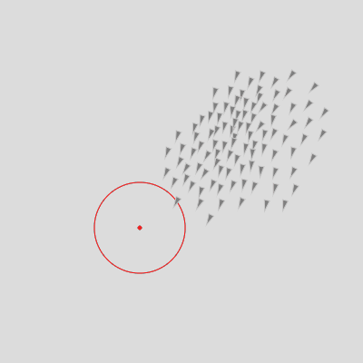

LAG6U6 // 2021-2022
====================================

Nous continuerons d'explorer les potentialités de l'écosystème [p5.js](https://p5js.org/) au travers d'algorithmes graphiques (systèmes de particules, agents autonomes, automates cellulaires, ...) en mettant l'accent sur la production de visuels animés interactifs en temps réel et la création d'outils basés sur les technologies web.

## Sketches en ligne
✍️ https://editor.p5js.org/v3ga/collections/EkLsXqSBF

## Document pour le rendu
https://docs.google.com/spreadsheets/d/1wcUgknXfZdLncT7ZxOcOlTfCT9JX6eqtHssHOHnHIkM/edit#gid=0

## Cours en ligne LAG6U6 2021
✍️ [Playlist Youtube](https://www.youtube.com/playlist?list=PLSQ5mjdHDgdBh9itCsCRzZcHSpnHldDu3)

## Cours #01 — Remise dans le bain — 17 janvier 
Ce premier va être une remise dans le bain en revoyant les notions fondamentales vues l'an passé. Nous avons aborder une brique importante de la programmation : la notion de classe.<br /> Nous allons travailler sur un système de particules en reprenant notamment le modèle de bille dans ce sketch : https://editor.p5js.org/v3ga/sketches/JoO-Vi58) et nous reverrons notamment le stockage d'objets dans un tableau (sketch en ligne avec des particules : https://editor.p5js.org/v3ga/sketches/HbpmEVc_v)

## Cours #02 — Champ vectoriel (flow field) — 24 janvier
Nous allons re-travailler la notion de classe vue la semaine passée. A cette occasion, nous allons re-utiliser la classe *bille* (renommée *particle*) dans deux contextes différents pour les animer : 
* particules plongées dans un *flow-field* (ou champs vectoriel), où à chaque point du canvas nous allons obtenir un vecteur (vx,vy) définissant la vitesse d'une particule. Ce champ pourra être statique ou évoluer dans le temps. Nous reverrons notamment la fonction de [Perlin noise](https://p5js.org/reference/#/p5/noise).
  * [excellent article](https://tylerxhobbs.com/essays/2020/flow-fields) de l'artiste [Tyler Hobbs](https://tylerxhobbs.com/) à ce sujet.
  * [article](https://genekogan.com/code/p5js-perlin-noise/) de Gene Kogan sur le Perlin noise dans p5.js
  <br>
  
## Cours #03 — 31 janvier
À rattraper.

## Cours #04 — Bruit et forces — 6 février
Le cours s'articulera autour de deux notions : 
1. [Bruit de perlin](https://en.wikipedia.org/wiki/Perlin_noise) ou « perlin noise » que nous avons utilisés dans notre système de particules. Je reviendrai un peu plus en détail sur cette fonction.
2. En complément du cours précédent, nous allons adjoindre à nos particules des propriétés de masse et d'accélération pour pouvoir leur appliquer des forces en utilisant [la deuxième loi de Newton](https://fr.wikipedia.org/wiki/Lois_du_mouvement_de_Newton#Deuxi%C3%A8me_loi_de_Newton_ou_principe_fondamental_de_la_dynamique_de_translation) :<br>*" l'accélération subie par un corps [...] est proportionnelle à la résultante des forces qu'il subit, et inversement proportionnelle à sa masse m."*
En particulier, nous allons appliquer à nos particules des forces d'attraction et de répulsion de manière dynamique, en fonction des interactions avec l'utilisateur par le biais de la souris.

<a title="After Godfrey Kneller
, Public domain, via Wikimedia Commons" href="https://commons.wikimedia.org/wiki/File:GodfreyKneller-IsaacNewton-1689.jpg"></a><a href="https://editor.p5js.org/v3ga/sketches/rlFXZoYtQ">
 
 ### Templates
* [Template particules « vide »](https://editor.p5js.org/v3ga/sketches/eawS57yxV)<br />*On va partir de ce sketch pour implémenter la gestion des forces pour une particule.*
 
 ### Librairies 
* [p5_timer.js](https://licence.designbordeaux.fr/LAG6U6/p5_timer.js)
 
 ## Cours #05 — Attracteurs et physique des solides
 * Prise en main de la librairie [matter.js](https://brm.io/matter-js/), création d'objets « physiques » dans le canvas. Interaction avec la souris, création d'un objet au click. 
 
<a href="https://editor.p5js.org/v3ga/sketches/BkpiCy2zD"></a> 
 
 ## Templates
 * [template particules / forces](https://editor.p5js.org/v3ga/sketches/oVlvksaf2)
 * [template matter.js](https://editor.p5js.org/v3ga/sketches/uzgKRF2ld)
 
 
 ## Cours #06 — Physique des solides (bis)
Dans ce cours, nous allons continuer d'explorer la librairie [matter.js](https://brm.io/matter-js/) avec la création d'objets physiques de manière interactive. 
Nous allons pour cela utiliser : 
1. le clavier pour fabriquer une machine à écrire où les lettres tapées sont soumises à la gravité.  
2. [p5.speech](https://idmnyu.github.io/p5.js-speech/) qui permet de faire de la reconnaissance vocale. L'idée sera d'analyser les mots prononcés pour les "transformer" en objets physiques dans notre scène.

Nous exploiterons aussi la création d'objets statiques (obstacles).
Pour faciliter l'inclusion des fonctions "helpers" liées à *matter.js*, j'ai placé un fichier en ligne. L'avantage est qu'un changement sur ce fichier se répercute sur l'ensemble des sketches qui utilisent ce fichier.

```html
<script src="https://licence.designbordeaux.fr/LAG6U6/p5_matter_helpers.js"></script>
```
 
## Templates
* [Template matter.js avec librairie externe](https://editor.p5js.org/v3ga/sketches/C-vgMAQkt) 
* [Template p5.speech](https://editor.p5js.org/v3ga/sketches/imv9uc9Ci) 

#### Références artistiques
* [Josh Nimoy / BallDroppings](https://experiments.withgoogle.com/balldroppings)
* [Zach Lieberman & Golan Levin / Manual Input Sessions](https://vimeo.com/22518283)
* [Zach Lieberman & Golan Levin / Messa Di Voce](https://www.youtube.com/watch?v=STRMcmj-gHc)

 ## Cours #07 - 7 mars
 À rattraper.
 
## Cours #08 - Typographie générative - 14 mars 
Nous allons utiliser une fonctionnalité de « segmentation » de glyphes d'une fonte donnée (par le biais de la fonction [textToPoints](https://p5js.org/reference/#/p5.Font/textToPoints)). 
* Dans un premier temps, nous allons explorer les possibilités graphiques liées au dessin d'un motif pour chaque point d'un glyphe. 
* Ensuite, nous reprendrons notre classe de particules pour générer de nouveaux glyphes. J'ai pour cette occasion remanier [la classe particule](https://licence.designbordeaux.fr/LAG6U6/p5_particle.js) en lui adjoignant des méthodes pour la gestion des attracteurs / repousseurs.<br />Cela simplifie grandement l'écritude du code pour l'application de forces notamment. Les particules ont la possibilité de freiner, par application d'une force dont la direction est opposée au vecteur vitesse.
 
<a href="https://editor.p5js.org/v3ga/sketches/homN5_zuL"></a><a href="https://editor.p5js.org/v3ga/sketches/w45GL2aKE"></a>

Voici les nouvelles fonctionnalités sur la classe **particle** : 
```js
function brake(intensity);
function isInsideCircle(cx,cy,radius);
function repelledBy(x,y,intensity,?dmin);
function attractedTo(x,y,intensity,?dmin);
function brake(intensity);
````
 
#### Template
* [Template glyphes + particle.js](https://editor.p5js.org/v3ga/sketches/qdIi_X3Oq) 

## Cours #09 - Typographie générative (bis) - 21 mars 
Nous allons retravailler sur ce principe de typographie générative en « dupliquant » et transformant  le contour des lettres en utilisant une boucle et les fonctions de transformation. Nous ajouterons une interface graphique pour ajuster en direct ces paramètres de transformation.
 
<a href="https://editor.p5js.org/v3ga/sketches/ILaDeaz9s"></a><a href="https://editor.p5js.org/v3ga/sketches/ILaDeaz9s"></a> 

 
 #### Template
* [Template glyphes](https://editor.p5js.org/v3ga/sketches/1bssECwWy) 
 
#### Projet de typographie générative
Le projet aura pour but de créer des dessins génératifs de lettres, l'idée sera de produire un alphabet complet de A à Z. 
Le projet pourra se faire par binôme et sera à rendre pour le 4 avril.  

## Cours #11 - Agents autonomes (boids) - 4 avril 
Ce cours utilise la classe *Boid* (étendue pour ce cours) disponible ici : https://p5js.org/examples/simulate-flocking.html

* Etudes des agents automes de type [« boids »](https://fr.wikipedia.org/wiki/Boids)
  * comportement *seek* et *arrive*.
  * comportement de groupe *separate*, *alignment*, *cohesion*.
* Gestion de l'historique de positions des boids.

 Principales fonctionnalités de la classe **Boid**
 ```js
// met à jour la position en fonction de l'accélération, qui dépend des forces appliquées au boid
function update();
// applique une force f au boid
function applyForce(f);
// calcule une force pour diriger le boid vers une cible (target)
function seek(target); 
// comportement de groupe, calcule une force pour que le boid aligne sa vitesse avec la vitesse moyenne du groupe de boids
function align(boids);
// comportement de groupe, calcule une force pour que le boid rejoigne le centre du groupe 
function cohesion(boids);
// comportement de groupe, calcule une force pour que le boid "essaye" d'éviter les autres boids du groupe
function separate(boids,separation);
// teste la position du boid et le repositionne à « l'opposé »
function borders();
// dessine le boid
function render();
// activate l'historique du boids, ie sauve ses [nb] dernières positions
function activateHistory(nb);
// mise à jour + dessin de l'historique des positions du boid
function updateHistory();
function renderHistory();
 
````
 
<a href="https://editor.p5js.org/v3ga/sketches/zmvm3KCFI" target="_blank"></a>
<a href="https://editor.p5js.org/v3ga/sketches/zmvm3KCFI" target="_blank"></a>
 
 ### Template
 * [Template / boid](https://editor.p5js.org/v3ga/sketches/zYKRWCTqZ)
 
 ### Références
 * [Nature of Code / Autonomous agents](https://natureofcode.com/book/chapter-6-autonomous-agents/)
 * [Craig Reynolds / Boids](https://www.red3d.com/cwr/boids/)

 
