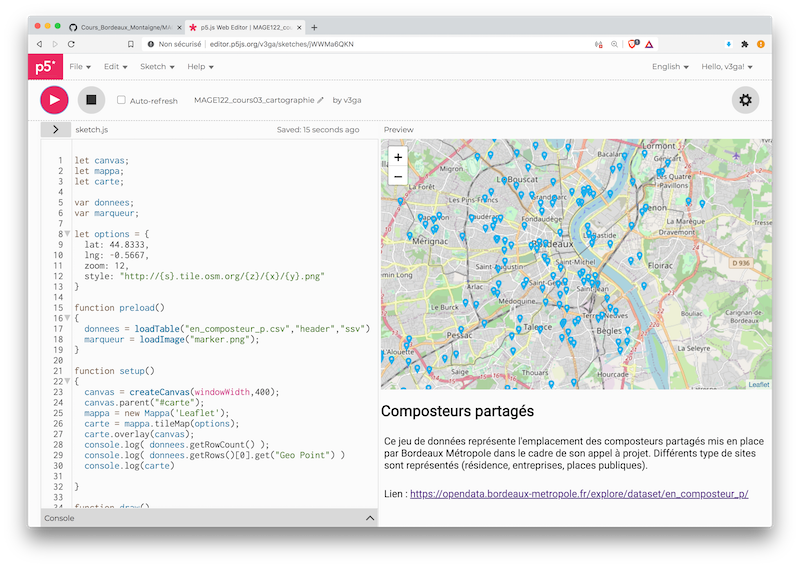

MAG1E22 — 2020
===============================================

:point_right: **Dossier des sketches vus en cours** :point_left:<br /> 
[https://editor.p5js.org/v3ga/collections/eQTmOS6Ba](https://editor.p5js.org/v3ga/collections/eQTmOS6Ba) 

Ce cours (24h) aura pour but de se familiariser avec la programmation dans un contexte web avec les outils de l'écosystème [p5.js](https://p5js.org/), et d'entrevoir les possibilités de réalisation / production d'outils dans le cadre de vos projets.
Nous explorerons en particulier le domaine de la visualisation de données en exploitant les possibilités du [portail OpenData](https://opendata.bordeaux-metropole.fr/) de Bordeaux Métropole.<br /><br />
Sur une note plus ludique en fin de semestre, une introduction sera faite aux techniques de "machine learning" par le biais de la librairie [ml5.js](https://ml5js.org/) pour créer un filtre personnalisé réagissant aux traits de votre visage pour être utilisé en ligne sur des systèmes de visio. (Zoom, etc...) :point_right: https://thecodingtrain.com/CodingChallenges/157-zoom-annotations.html


## Cours #01 — lundi 02 novembre 2020
## Cours #02 — lundi 09 novembre 2020 
* Présentation du studio [2Roqs](http://www.2roqs.fr) 
* Introduction à [p5js](https://p5js.org/) (« Processing pour le web »)
  * [anatomie d'un projet p5js](https://p5js.org/get-started/)
  * (ré)visions des bases de programmation vues avec [Processing](https://processing.org/)
     * gestionnaires [setup()](https://p5js.org/reference/#/p5/setup) et [draw()](https://p5js.org/reference/#/p5/draw)
     * variables / fonctions / boucles / conditions
* Présentation des formats de données [CSV](https://fr.wikipedia.org/wiki/Comma-separated_values) et [JSON](https://fr.wikipedia.org/wiki/JavaScript_Object_Notation).     
* Chargement d'un fichier au format csv, accès aux données :point_right: https://editor.p5js.org/v3ga/sketches/6dIdaFTC8

#### Pour lundi 16 novembre
* former des groupes de 3 personnes maximum pour le projet de visualisation de données. Merci de m'envoyer la liste des groupes par e-mail.
* Identifier sur le portail [OpenData de Bordeaux](https://opendata.bordeaux-metropole.fr/) un ou plusieurs jeux de données (idéalement qui se combinent) pour réaliser une mini-application de data-visualisation.

### Références
* [Site p5.js](https://p5js.org/)
* [Éditeur p5.js en ligne](https://editor.p5js.org/)
* [Code! Programming for beginners with p5.js par Daniel Shiffman](https://www.youtube.com/watch?v=yPWkPOfnGsw)
* [Javascript basics sur le wiki de p5.js](https://github.com/processing/p5.js/wiki/JavaScript-basics)
* [Cours en ligne en français](http://www.lyceelecorbusier.eu/p5js/)
* [Debugging! p5.js](https://p5js.org/learn/debugging.html)
* [Designing programs par Mark Webster](https://designingprograms.bitbucket.io)

## Cours #03 — lundi 16 novembre 2020
* Parcours des données .csv par une boucle : traitement en série, traduction graphique des informations. Exemple avec la liste des prénoms sur la commune de Talence, on va compléter le sketch étudié la semaine dernière :point_right: https://editor.p5js.org/v3ga/sketches/6dIdaFTC8
* Intégration d'une carte dans un sketch par une librairie additionnelle [mappa.js](https://mappa.js.org/)
  * structure d'une page web, intégration de blocs d'informations dans le HTML de la page.
  * ajout d'informations géolocalisées extraites depuis un fichier .csv
    * à choisir sur https://opendata.bordeaux-metropole.fr/pages/accueil/
  * mise en ligne par le biais d'un client FTP ([Filezilla](https://filezilla-project.org/)) sur le serveur web du master sur un espace dédié.




#### Connexion FTP
* Hôte : 7x6pk.ftp.infomaniak.com
* Identifiant : 7x6pk_etudiants

Les dossiers seront accessibles depuis cette adresse :point_right: https://master.designbordeaux.fr/projets/2020-2021/MAG1E22/ :point_left:

#### Intégrer la librairie mappa.ps à un projet p5.js
Dans l'éditeur p5.js en ligne, ouvrir le fichier index.html et ajouter dans la balise <head> la ligne suivante qui permet d'importer la librairie : 
```html
<script src="https://unpkg.com/mappa-mundi@0.0.5/dist/mappa.js" type="text/javascript"></script>
```
Au final vous devriez avoir ceci : 
```html
<head>
    <script src="https://cdnjs.cloudflare.com/ajax/libs/p5.js/1.1.9/p5.js"></script>
    <script src="https://cdnjs.cloudflare.com/ajax/libs/p5.js/1.1.9/addons/p5.sound.min.js"></script>
    <script src="https://unpkg.com/mappa-mundi@0.0.5/dist/mappa.js" type="text/javascript"></script>
    <link rel="stylesheet" type="text/css" href="style.css">
    <meta charset="utf-8" />
</head> 
```

#### Transformer une donnée de position .csv en position 
```js
function getPosition(geoPoint)
{
  return geoPoint.split(",").map(x=>Number(x))  
}
```

## Cours #04 — lundi 23 novembre 2020 
#### Visio. en ligne
:point_right: https://www.youtube.com/watch?v=IQd74GToOIM :point_left:

#### Sketch en ligne
:point_right: https://editor.p5js.org/v3ga/sketches/bNsMeqf3x :point_left:

#### Plan du cours 
* Utilisation de fonctionnalités avancées de la librairie de cartographie 
  * services de géolocalisation du navigateur, positionnement sur la carte.
  * création de marqueurs "natifs" et association d'une popup d'informations.
* Création d'un bloc d'informations dans la page, modification depuis le script (fonctions [select()](https://p5js.org/reference/#/p5/select) et html()) 
  * éléments **div** et **li** (liste)
  * mise en forme css
* Téléversement en ligne par FTP.
 

## Cours #05 — lundi 30 novembre 2020 

## Cours #07 — mardi 8 décembre 2020

## Projet application web de cartographie
A partir d'un jeu de données identifié sur [le site Atelier OpenData de Bordeaux](https://opendata.bordeaux-metropole.fr/explore/), vous produirez une application web interactive intégrant une carte et permettant d'afficher de manière ergonomique une sélection de données pertinentes pour les utilisateurs potentiels de votre application. Vous justifierez le choix de ces données et les potentialités de votre application en émettant des hypothèses réalistes sur des fonctionnalités envisageables, pouvant être corrélées à d'autres ensembles de données.

### Evaluation 
Le projet peut se faire par groupe de 3 maximum.

<table>
 <tr><td>:point_right: adaptation du template de code, fonctionnement en ligne</td><td>8 points</td></tr>
 <tr><td>:point_right: intégration et choix des données, potentialités de l'application, innovation</td><td>5 points</td></tr>
 <tr><td>:point_right: mise en forme, personnalisation de l'apparence, expérimentation, recherches personnelles</td><td>4 points</td></tr>
 <tr><td>:point_right:vidéo explicative </td><td>3 points</td></tr>
</table>

#### Livrables
* une application web, accès en ligne sur le serveur du master.
* une vidéo explicative (max 1mn30) à placer dans le dossier en ligne. Format vidéo : 1920 x 1080 (HD)

#### Date de rendu
à remettre pour le **vendredi 11 décembre** au plus tard.

#### Groupes
* Amélie et Flavie.


