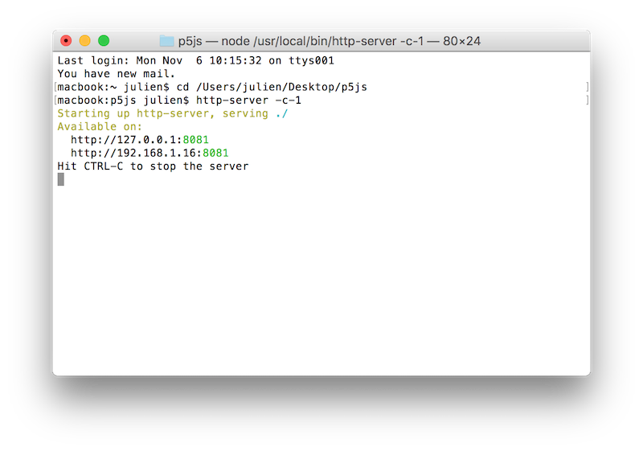

Outils de cartographie
===============================================

### Méthodes de travail

(En référence à [la notice d'installation](https://github.com/processing/p5.js/wiki/Local-server) sur le wiki de p5.js)

1. Ouvrir le terminal
 - :point_right: Mac /  cmd + barre espace et taper « terminal »
 - :point_right: PC /  windows puis rechercher et taper « cmd »

2. Se déplacer dans le dossier de travail avec la commande **cd** (change directory). Vous pouvez taper **cd** puis **glisser déposer le dossier** dans le terminal, son chemin entier va s'inscrire. 

3. Démarrer le serveur avec la commande 
```
http-server -c-1
```

4. Copier-coller une des deux adresses dans votre navigateur pour accéder à l'arborescence de vos dossiers de sketchs. Ne fermez pas la fenêtre du terminal, sinon le serveur s'arrêtera.
```
http://127.0.0.1:8080
```




## Cours #01 — lundi 16 octobre 2018
* service de cartographie [Mapbox](https://www.mapbox.com/)
* intégration de données extraites depuis [OpenStreetMap](https://www.openstreetmap.org)
  * utilisation du format de données [GeoJson](https://fr.wikipedia.org/wiki/GeoJSON)
  * utilisation de l'outil [Overpass Turbo](https://overpass-turbo.eu/) pour extraire des données sur une région donnée. 

## Cours #02 — lundi 19 novembre 2018
* Appliquer un style : 
  * sur la carte : https://www.mapbox.com/api-documentation/#styles 
  * sur les lignes (pour les chemins, routes, etc...)
  * sur les poylgones (pour les bâtiments)
* Interagir avec les éléments
  * ajouter un gestionnaire de click sur la carte.
* Exemple de requête : https://overpass-turbo.eu/s/DRM
* « Features » d'une carte : https://wiki.openstreetmap.org/wiki/Map_Features#Building

#### Rendu pour lundi 26 novembre 2018
Produire une page web avec les composants suivants : 
* **carte mapbox** :point_right: pensez à utiliser votre access token dans la partie <script>.
* **titre + texte** court qui présente la visualisation. 
* **2+ sources de données** tirées de overpass turbo, avec de jeux de données qui concernent votre projet de recherche. Je n'ai pas fait de recherches complémentaires mais il doit existe d'autres sources de données pour trouver des fichiers .geojson
* **affichage au click** dans lad <div> dont l'id est infos (accessible par #infos pour mettre en forme les styles css)

À fournir : 
* un dossier avec les fichiers de données .geojson et la page index.hml au format zip.
* vous pourrez télécharger ce fichier .zip sur le blog directement, je m’occuperai de l’intégration sur le wordpress sur une page à part pour chaque groupe.
