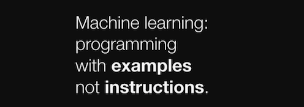
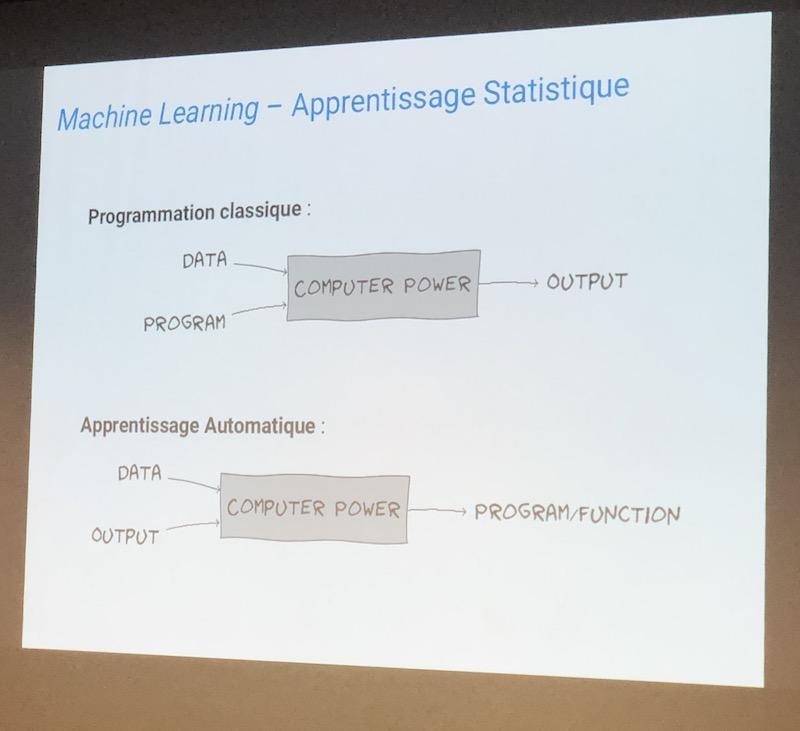

Introduction « Machine Learning »
===============================================

Ce cours sera consacré à une initiation aux techniques de « machine learning » grâce à la librairie [ml5.js](https://ml5js.org/) et [teachable machine](https://teachablemachine.withgoogle.com/)

Ces techniques sont utilisées dans le domaine de l'intelligence artificielle pour donner la capacité à une machine programmable « d'apprendre » à partir d'un ensemble de données afin de réaliser des tâches automatiques de classification ou de prédiction par exemple. Nous nous familiarisons avec les notions de réseaux de neurones, d'apprentissage supervisé, ... et d'autres termes que vous avez peut-être entendu ici ou là et qui paraissent obscurs.

Quelques exemples : 
* Détection de spams.
* Suggestion de vidéos, morceaux de musique sur les plateformes Youtube, Spotify, etc ... 
* Reconnaissance de visages.
* Reconnaissance vocale (Siri, Alexa par exemple)
* Imagerie médicale, détection de tumeurs pas exemple.
* Voiture autonome

L'objectif de ce cours sera de donner des clés de compréhension de ce type d'algorithmes à travers la réalisation d'un mini-prototype utilisant la classification d'images.

### Sketches à télécharger
* [s01_cours01.zip](s01_cours01.zip)

## Jeudi 11 décembre
Ce cours est presque une transcription directe des vidéos en ligne de Daniel Shiffman sur le sujet. Je vous invite à consulter ces vidéos en ligne pour (re)voir les notions que nous allons voir aujourd'hui.

* Révisions p5.js
  * lancer un serveur local ( :point_right: [instructions](https://github.com/v3ga/Cours_Bordeaux_Montaigne/tree/master/MAG1E22_2018_2019#serveur-web-en-local)   )  
  * [structure d'un programme](https://p5js.org/reference/#/p5/setup) p5.js avec gestionnaire de démarrage et boucle de dessin.
  * chargement et affichage d'une image.
  * [affichage d'un flux vidéo webcam](https://p5js.org/examples/dom-video-capture.html).
* vue d'ensemble de la librairie [ml5.js](https://ml5js.org/)
  * [classification](https://learn.ml5js.org/docs/#/reference/image-classifier?id=description) d'une image simple en utilisant le modèle pre-entrainé « MobileNet ». Que veut dire modèle pré-entrainé ? 
  * application à un flux vidéo, classification en temps réel.
  * Le modèle n'est entrainé pour détecter que certains types d'objets (classes), comment faire pour l'entrainer à reconnaitre nos propres types d'images ? :point_right: Utilisation du « transfer learning » via le composant [« Feature Extractor »](https://learn.ml5js.org/docs/#/reference/feature-extractor) de ml5.js

### Références
* [Kyle MacDonald / The limits of learning](https://www.youtube.com/watch?v=kWvHjp8vifM)
* [Daniel Shiffman / Image Classification with MobileNet](https://www.youtube.com/watch?v=yNkAuWz5lnY)
* [Daniel Shiffman / Webcam Image Classification](https://www.youtube.com/watch?v=D9BoBSkLvFo)
* [Daniel Shiffman / Transfer learning with Feature Extractor](https://www.youtube.com/watch?v=kRpZ5OqUY6Y)

### Réseaux de neurones
* [3blue1brown / Neural networks](https://www.3blue1brown.com/neural-networks)

### Modèles de réseaux de neurones
Un réseau de neurones est construit et dédié à réaliser une tâche particulière : classer des images, détecter des objets dans une image, générer des images, du texte, ... Voici quelques modèles :  

* Détection d'objets : 
  * [YOLO](https://pjreddie.com/darknet/yolo/)
* Classification d'images : 
  * ResNet-50
  * MobileNet, [liste des labels détectés](https://github.com/moxel/caffe-mobilenet/blob/master/labels.txt) 
* Génération de texte : 
  * [GPT-2](https://www.01net.com/actualites/gpt-2-cette-intelligence-artificielle-pourrait-devenir-l-arme-ultime-des-trolls-1802378.html)
  * [Générateur de textes aléatoires](http://enneagon.org/phrases) *pas vraiment construit à l'aide d'un réseau de neurones mais bonne alternative au lorem ipsum*
* Génération d'images : 
  * [Fast Style Transfer](https://github.com/lengstrom/fast-style-transfer/)
  * [pix2pix](https://affinelayer.com/pixsrv/)
* Génération d'image à partir de texte : 
  * [AttnGAN](https://github.com/taoxugit/AttnGAN)

### Services en ligne 
* Machine learning for creators [Runway ML](https://runwayml.com/)
 * [Runway ML + p5.js](https://learn.runwayml.com/#/networking/examples?id=p5js)

### Outils & liens
* [ml5.js // Friendly Machine Learning for the web](https://ml5js.org/), librairie basée sur [tensorflow.js](https://www.tensorflow.org/js/?hl=fr)
* [teachable machine](https://teachablemachine.withgoogle.com/)
* [teachable machine + p5.js](https://github.com/yining1023/teachable-machine-p5)
* [ml4a - Machine Learning 4 Artists](https://ml4a.github.io/)

### Divers
* [Ctrl Shift Face](https://www.youtube.com/channel/UCKpH0CKltc73e4wh0_pgL3g) 
* [Le Monde / Deepfake, faut-il avoir peur de ces vidéos trafiquées ? ](https://www.lemonde.fr/pixels/article/2019/11/24/deepfakes-faut-il-avoir-peur-de-ces-videos-trafiquees_6020333_4408996.html)
* [Le candidatron](https://twitter.com/LeCandidatron), basé sur [thispersondoesnotexist.com](https://thispersondoesnotexist.com/)

### Images

